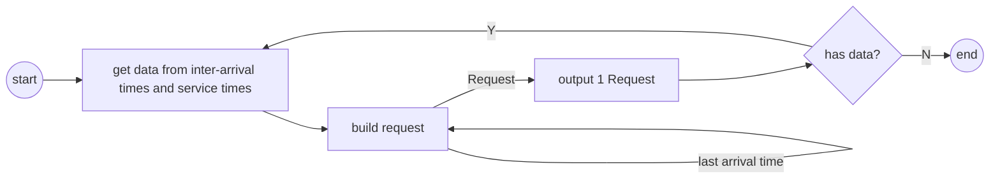

# 深入理解 postgrelsql

[toc]

文章列表
- part1
- part2



And here is the python code.

```python {.line-numbers}
request_list = []
last_arrival = 0
for i in range(len(interarrival_time_list)):
    request_list.append(Request(
         interarrival_time_list[i],
         service_time_list[i], 
         last_arrival + interarrival_time_list[i]))
    last_arrival += interarrival_time_list[i]
```

$$
g(t) = 
\begin{cases}
    0 &\text{if } 0 \le t \le \alpha\\
    \frac{\gamma}{t^\beta} &\text{if } \alpha \le t\\
\end{cases}
$$